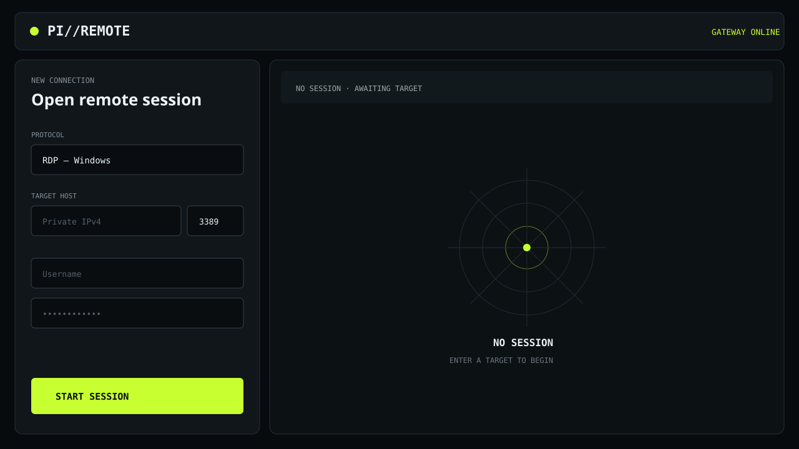

# Guacamole Lite for Raspberry Pi Zero 2 W

A minimal SSH/RDP/VNC web console for low-memory ARM64 Raspberry Pi systems.
SSH local forwarding is the secure default. An optional VPN mode binds the web
gateway to one exact private VPN address and protects every HTTP and WebSocket
request with generated Basic Auth credentials.



## What is included

- A responsive UI down to 320 px with mouse, keyboard, touch, and fullscreen
  support.
- A `guacamole-lite` 1.2.0 gateway with five-minute tokens protected by
  AES-256-CBC encryption and HMAC-SHA256 authentication.
- SSH, RDP, and VNC access to private IPv4 targets (RFC1918 and CGNAT), plus a
  locked-down `This Pi` SSH shortcut, limited to one concurrent session.
- Apache `guacd` pinned to commit
  `f22a2df129d9ecf279466e9bcf44cd026e23e6bd` from `staging/1.6.1`.
- Sandboxed systemd services, an 80 MiB V8 heap limit, and declarative cgroup
  memory limits.
- Build, install, verification, tunnel/VPN access, rollback, and uninstall
  scripts.

The stack does not use Docker, Tomcat, Java, a database, or a reverse proxy.
The installer does not modify SSH, WARP, Cloudflared, Samba, or Pi Connect.

## Requirements

- Raspberry Pi OS or Debian 13 ARM64 (`aarch64`).
- Node.js and npm, with Node.js 20 or newer available at `/usr/bin/node`.
- systemd and Internet access for the initial build and installation.
- An SSH client on the workstation for the default access mode.
- For direct VPN access, an existing encrypted private VPN interface on the Pi.

The Pi Zero 2 W builds `guacd` with one job to reduce peak memory use. The
build can take a while; enable swap and keep a backup SSH session open. Source
and npm dependencies are pinned by commit/version, while Debian packages come
from the repositories configured on the Pi.

## Installation

On the Pi:

```sh
git clone https://github.com/LamPPKK/guacamole-lite-pi-zero.git
cd guacamole-lite-pi-zero
sudo ./scripts/install.sh
```

That command performs the complete pinned build, installs both hardened
systemd services, generates the token key, starts the gateway, and verifies the
result. It does not install or reconfigure VPN or SSH software.

To use an existing WARP, Tailscale, WireGuard, or other private VPN address,
find the address already assigned to the Pi and pass it during installation:

```sh
ip -4 -brief address
sudo ./scripts/install.sh --vpn-address 100.64.0.10 --vpn-user pi-remote
```

The address must be the Pi's exact RFC1918 or CGNAT address. The installer
prints a generated web password once. Save it immediately. It will refuse
`0.0.0.0`, public IP addresses, unassigned addresses, and VPN mode without
authentication.

If the correct `guacd` build is already installed:

```sh
sudo ./scripts/install.sh --skip-guacd-build
```

Use `--no-apt` to skip build dependency installation when the required
packages are already present. Before replacing the gateway, the installer
saves existing files under `/var/backups/guacamole-lite-pi/`.
If any deployment, service restart, access configuration, or verification step
then fails, the installer automatically restores that backup and restarts the
previous gateway. The newly compiled compatible `guacd` prefix is retained for
a later retry.

The default build leaves its compiler tools and development headers installed.
This avoids an unsafe automatic `apt autoremove` removing shared libraries that
the runtime needs, and is useful on a development Pi. Review packages manually
if storage is constrained; do not remove `guacd` runtime libraries reported by
`scripts/verify.sh`.

## Access through an SSH tunnel (default)

From macOS, Linux, or WSL in a checkout of this repository:

```sh
./scripts/open-tunnel.sh pi@pi-host
```

Then open [http://127.0.0.1:8080](http://127.0.0.1:8080). Pass a second
argument to use another local port, for example
`./scripts/open-tunnel.sh pi@pi-host 9080`.

## Access through an existing VPN

Open `http://VPN_IP:8080` from another authenticated peer on the same private
VPN and enter the generated Basic Auth credentials. Switch modes later with:

```sh
sudo ./scripts/configure-access.sh status
sudo ./scripts/configure-access.sh vpn 100.64.0.10 pi-remote
sudo ./scripts/configure-access.sh ssh-tunnel
```

VPN mode does not add TLS. Use it only across an encrypted private VPN, never
by forwarding port 8080 from a router or exposing it to the public Internet.
The configuration script never changes WARP, Tailscale, WireGuard, SSH, or any
other network service.
At boot, the gateway waits and retries if that exact VPN address has not
appeared yet, instead of exhausting systemd's restart limit.

## Remote sessions

Targets must normally use a private IPv4 address. SSH defaults to port 22, RDP
to 3389, and VNC to 5900. Select SSH and enable **This Pi** to connect to the
Pi's own SSH service without entering an address. The server always forces this
shortcut to `127.0.0.1:22`; it cannot be used to reach other loopback services.

For SSH, paste a matching OpenSSH `known_hosts` line into the optional host-key
field to authenticate the target. Credentials exist only in the browser tab's
memory and in a short-lived connection token; the gateway does not persist them
or write them to logs.

## Verification and operations

```sh
sudo ./scripts/verify.sh
sudo systemctl status guacd guacamole-lite
sudo journalctl -u guacd -u guacamole-lite --since today
curl http://127.0.0.1:8080/healthz  # SSH tunnel mode
```

In VPN mode, the health endpoint is also protected and returns HTTP 401
without the generated Basic Auth credentials. `verify.sh` checks that
fail-closed behavior without printing or storing the password.

Validate a source checkout before committing:

```sh
npm ci --ignore-scripts
./scripts/check.sh
```

Installation paths:

| Component | Path |
|---|---|
| Gateway and UI | `/opt/guacamole-lite/1.2.0` |
| `guacd` | `/opt/guacamole-server/1.6.1-staging` |
| Runtime secret | `/etc/guacamole-lite/env` |
| Installer backups | `/var/backups/guacamole-lite-pi` |
| Web listener | `127.0.0.1:8080` by default, or one exact private VPN IP |
| `guacd` listener | `127.0.0.1:4822` in every mode |

## Rollback and uninstall

Restore the most recent installer backup:

```sh
sudo ./scripts/rollback.sh
```

You may instead pass a specific timestamped directory below
`/var/backups/guacamole-lite-pi/`. Rollback preserves the compiled `guacd`
prefix to avoid an unnecessary rebuild.

Remove the gateway while preserving its secret, `guacd`, and backups:

```sh
sudo ./scripts/uninstall.sh
```

Remove the secret and versioned `guacd` prefix as well:

```sh
sudo ./scripts/uninstall.sh --purge
```

Upstream `make install` places FreeRDP plugins in the system plugin directory.
The uninstaller intentionally leaves them in place because other software may
use them. A forced build can overwrite same-named plugins from another
Guacamole installation; use a dedicated Pi or back up those plugins before
running `--force`.

## Known limitations

This staging build is used because FreeRDP 3 on Debian 13 requires newer
compatibility code than the Guacamole 1.6.0 release provides. The source is a
staging branch and upstream marks its FreeRDP 3 support as experimental. Test
your target systems before relying on it for long-running access.

SSH password authentication is supported. Private-key authentication and
browser file transfer are intentionally not exposed in this minimal UI. If no
host-key line is supplied, `guacd` cannot authenticate the SSH server identity;
use the optional field whenever you know the target's trusted key.

`MemoryHigh` and `MemoryMax` only take effect when the kernel exposes the
cgroup v2 memory controller. Without it, the gateway still uses an 80 MiB V8
heap limit and rejects a second concurrent session. See
[Architecture](docs/ARCHITECTURE.md), [Security](docs/SECURITY.md), and
[Troubleshooting](docs/TROUBLESHOOTING.md) for details.

## License

Repository-specific code is MIT licensed. `guacamole-lite`, Apache Guacamole
Server, and the vendored browser client use Apache-2.0; see
[THIRD_PARTY_NOTICES.md](THIRD_PARTY_NOTICES.md).
